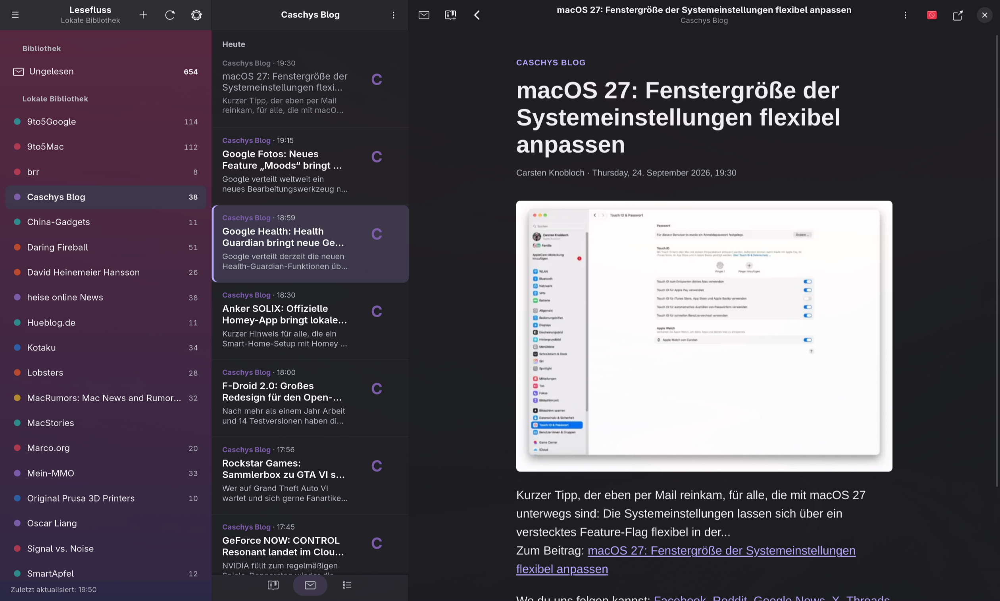

<div align="center">
  
  <h1>Lesefluss</h1>
  <p><strong>A quiet place for your feeds.</strong></p>
  <p>A native RSS reader for Linux, built for comfortable reading and a keyboard-first workflow.</p>
</div>



<p align="center">
  <a href="#installation">Install</a> ·
  <a href="#getting-started">Get started</a> ·
  <a href="#keyboard-shortcuts">Keyboard shortcuts</a> ·
  <a href="#development">Development</a>
</p>

Lesefluss brings your sources, article list and reading view together in one native window. It is written in Rust with GTK 4, libadwaita and WebKitGTK, and stores your library locally in SQLite. Its primary home is **Omarchy / Arch Linux on Wayland**.

Use it as an independent local reader, or connect a Feedly account to bring your subscriptions and reading state with you.

## Features

- **Your own library.** Subscribe to RSS and Atom feeds, discover feeds from a website URL, and organize them into groups.
- **A focused reading experience.** Three panes, a dedicated reading view, adjustable typography, compact lists and optional image previews.
- **Fast navigation.** Keyboard shortcuts, unread and saved filters, full-text article search and search within the current article.
- **Offline reading.** Read previously downloaded articles and keep saved articles available locally. Previously cached images remain available offline.
- **Portable subscriptions.** Import OPML with a preview and duplicate handling, or export your subscriptions.
- **Optional Feedly sync.** Import subscriptions and synchronize read and saved states, including queued changes made offline.
- **Your preferred appearance.** System, dark, light and Omarchy themes, plus English and German interfaces.
- **Local control.** Database backups and restore, configurable retention, image-cache controls and an option to block external images.

**Status:** early development, version 0.1.0. The local reader is the main entry point. Feedly is currently an experimental token-based integration; there is no built-in public OAuth sign-in flow. Accessibility, mixed-display scaling and live Feedly acceptance checks still have open items.

## Installation

### Arch Linux / Omarchy

Build from a checkout using the included `PKGBUILD`. This installs the `lesefluss` command, application-menu entry, icon and AppStream metadata.

Install the build tools and native libraries:

```sh
sudo pacman -S --needed \
  base-devel git rustup glib2-devel \
  gtk4 libadwaita webkitgtk-6.0 sqlite libsecret xdg-desktop-portal

rustup toolchain install stable --component rustfmt --component clippy
```

If Rust is already managed by rustup on your machine, keep that setup. Use the desktop-portal backend appropriate for your desktop session.

Clone and install:

```sh
git clone https://github.com/tobiasbischoff/lesefluss.git
cd lesefluss/packaging
makepkg -si
```

Run `makepkg` as your regular user; it requests elevated permissions when installing the package.

Launch **Lesefluss** from your application menu, or run:

```sh
lesefluss
```

To update an existing checkout and rebuild the package:

```sh
git pull --ff-only
cd packaging
makepkg -fsi
```

Run these update commands from the repository root. The package recipe builds this local checkout; it is not an AUR package or a standalone remote-source recipe.

### Build without installing

With the prerequisites above installed, run from the repository root:

```sh
cargo build --release --locked --bin lesefluss
./target/release/lesefluss
```

For development:

```sh
cargo run --locked
```

Other Linux distributions may work with equivalent development packages for GTK ≥ 4.12, libadwaita ≥ 1.5, GLib ≥ 2.80 and WebKitGTK 6.0. Arch / Omarchy is the tested target; prebuilt binaries, Flatpak and an AUR release are not currently provided.

## Getting started

1. Choose **Add feed** (`Ctrl+N`) and enter a feed or website URL. Select a discovered feed to subscribe.
2. Already use another reader? Open the menu and choose **Import OPML…** to bring your subscriptions over.
3. Select a source or group, then open an article. Use the unread, saved and all-article filters to control the list.
4. Right-click a source to rename it, choose groups, mark it as read or unsubscribe. Saved articles are retained when unsubscribing.
5. Open **Settings** (`Ctrl+,`) to adjust reading behavior, appearance, refresh intervals, storage and language.

English is the default interface language. Under **Settings → Language**, choose **English**, **Deutsch** or **System language**, then restart Lesefluss. System mode follows `LC_ALL`, `LC_MESSAGES`, then `LANG`; unsupported languages fall back to English. Feed content and your own source names stay in their original language.

For a one-off language override:

```sh
LF_LANG=de lesefluss
LF_LANG=system lesefluss
```

### Connecting Feedly

Choose **Connect to Feedly…** from the menu and supply a valid access token that your Feedly account is authorized to use. Token availability and API permissions depend on the account; Lesefluss does not currently provide a general sign-in flow or automatic token renewal.

Read and saved changes are queued locally and synchronized while Lesefluss is running. Subscriptions and groups are read from Feedly; subscription management on the Feedly server is not implemented. Disconnecting preserves local data.

Credentials are stored using Secret Service when available. A restricted-permission file is used as a fallback when a keyring is unavailable. Do not place tokens in the repository or include them in bug reports. The implementation and current integration constraints are documented in the [Feedly notes](docs/feedly-api-vertrag.md) and [remaining work](docs/m7-offen.md) (German).

## Keyboard shortcuts

| Shortcut | Action |
| --- | --- |
| `j` / `k` | Next / previous article |
| `n` / `p` | Next / previous unread article |
| `m` | Toggle read / unread |
| `s` | Save / unsave article |
| `o` | Open article in your browser |
| `Ctrl+N` | Add a feed |
| `Ctrl+R` | Refresh |
| `Ctrl+L` | Search the article list |
| `Ctrl+F` | Find in the current article |
| `Ctrl+Shift+P` | Reverse sort order |
| `Ctrl+Shift+M` | Mark the current section as read |
| `Ctrl+Z` / `Ctrl+Y` | Undo / redo |
| `F9` | Toggle reading view |
| `F6` / `Shift+F6` | Move between main panes |
| `Alt+Left` / `Esc` | Go back |
| `Ctrl+,` | Open settings |
| `Shift+F10` | Open the selected source's context menu |

Letter shortcuts can be disabled in Settings and do not intercept typing in text fields.

## Data, backups and privacy

Lesefluss uses the XDG base directories. When the corresponding environment variable is unset, it uses the usual directory under your home folder.

| Data | Default location |
| --- | --- |
| Library, settings and pending sync changes | `~/.local/share/lesefluss/library.db` (`$XDG_DATA_HOME`) |
| Cached images | `~/.cache/lesefluss/media/` (`$XDG_CACHE_HOME`) |
| Credential fallback files | `~/.config/lesefluss/` (`$XDG_CONFIG_HOME`) |

Use **Create backup…** for a consistent database snapshot. **Restore from backup…** validates the selected database and restores it on the next launch, preserving a safety copy of the previous library. A database backup does not include cached images or Feedly credentials. OPML exports contain subscriptions, not article content or reading state.

There is no telemetry, analytics or background service. Refresh and sync run only while the app is open. Fetching feeds, connecting to Feedly and loading external images contact their respective servers; image loading can be disabled in Settings. Article HTML is sanitized and rendered with a restrictive content security policy.

Lesefluss displays the content supplied by feeds. It does not scrape full articles from websites or bypass paywalls; use **Open in browser** when a feed only provides an excerpt.

## Development

The workspace separates the app, domain model, storage, sync engine, providers and reader:

```text
crates/
  app/              GTK interface and application orchestration
  domain/           Shared data types
  storage/          SQLite library, search and migrations
  sync/             Sync coordination
  provider-local/   Feed discovery, fetching and image cache
  provider-feedly/  Feedly API client
  reader/           HTML sanitization and article rendering
```

Run the checks from the repository root:

```sh
cargo test --workspace --locked
cargo clippy --workspace --all-targets --locked -- -D warnings
cargo fmt --all -- --check
cargo build --release --locked --bin lesefluss
```

Some tests start local HTTP servers and need permission to bind loopback sockets. `Cargo.lock` pins dependencies; `rust-toolchain.toml` selects the moving stable Rust toolchain. The [CI workflow](.github/workflows/ci.yml) builds and checks the workspace in an Arch Linux container and exercises packaging.

The helper binaries are `lesefluss-probe` (rendering prototype) and `lesefluss-bench` (database benchmark). Desktop integration uses the app ID `io.github.tobiasbischoff.Lesefluss`.

## Contributing and project notes

Bug reports and focused pull requests are welcome. Include reproduction steps, your desktop environment, installed GTK/WebKitGTK versions and relevant logs with credentials and personal data removed.

Development notes are currently mostly in German:

- [Remaining work and release criteria](docs/m7-offen.md)
- [Known limitations](docs/known-limitations.md)
- [Verification record](docs/abnahme-protokoll.md)
- [Performance measurements](docs/perf-report.md)
- [Privacy notes](docs/privacy.md)
- [Credits](docs/credits.md)

These documents include dated development observations; see the remaining-work checklist for subsequent fixes.

## License

Licensed under **MIT OR Apache-2.0**, at your option. See [LICENSE-MIT](LICENSE-MIT) and [LICENSE-APACHE](LICENSE-APACHE).

The icon and interface artwork were created for Lesefluss. No Reeder assets are included.
